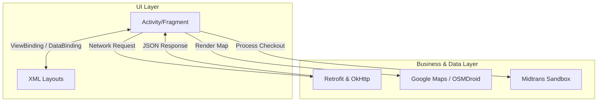
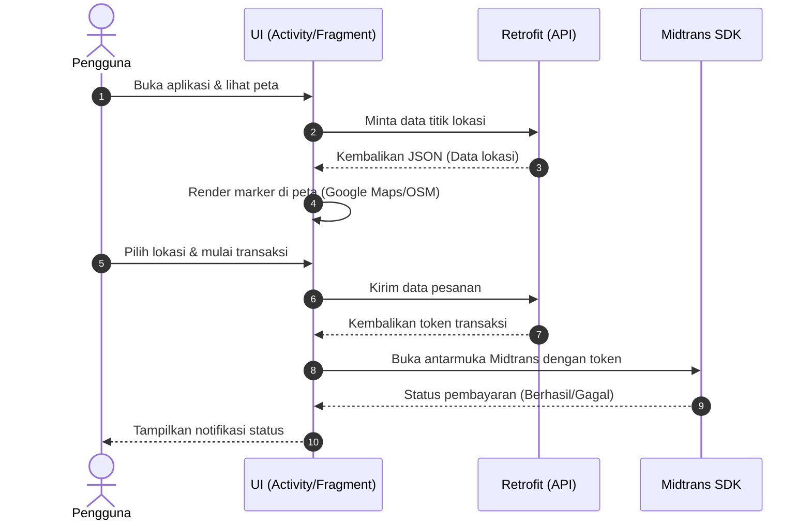

# BJBO Android App

BJBO adalah aplikasi Android native yang dibangun dengan Kotlin. Aplikasi ini menangani pemetaan (Google Maps & OSMDroid), pembayaran (Midtrans), dan konsumsi API eksternal (Retrofit).

## Arsitektur Sistem

Aplikasi memisahkan UI dan logika pemrosesan data. UI menggunakan ViewBinding dan DataBinding untuk mengikat antarmuka ke logika aplikasi. Komunikasi jaringan asinkron ditangani melalui Kotlin Coroutines.

## Kompleksitas dan Alur Data

Sistem memiliki beberapa titik integrasi yang berjalan bersamaan:

1. **Pemetaan dan Lokasi**: Aplikasi menggunakan Google Maps atau OpenStreetMap (OSMDroid) untuk merender peta dan melacak lokasi pengguna secara real-time.
2. **Jaringan**: Memakai Retrofit2 dengan converter Gson dan OkHttp logging interceptor untuk manajemen kueri API. Semua operasi I/O berjalan di luar thread utama (main thread) melalui Coroutines.
3. **Pembayaran**: Terintegrasi langsung dengan SDK Midtrans UIKit (mode Sandbox) untuk memproses transaksi belanja atau layanan.
4. **Manajemen Media**: Memanfaatkan Glide dan Picasso untuk memuat, meng-cache, dan menampilkan gambar asinkron agar UI tetap responsif.

## Spesifikasi Teknis

- **Bahasa**: Kotlin 1.8+
- **Minimum SDK**: 34 (Android 14)
- **Target SDK**: 34
- **Dependensi Utama**:
  - Retrofit 2.9.0 & Gson
  - Kotlinx Coroutines 1.6.4
  - Google Play Services (Maps & Location)
  - OSMDroid
  - Midtrans UIKit 2.3.0-SANDBOX
  - Glide 4.15.1 & Picasso 2.8

## Cara Menjalankan

1. Klon repositori.
2. Buka proyek melalui Android Studio.
3. Tunggu proses sinkronisasi Gradle selesai.
4. Hubungkan perangkat fisik Android atau jalankan emulator (API 34 direkomendasikan).
5. Klik **Run** atau tekan `Shift + F10`.
